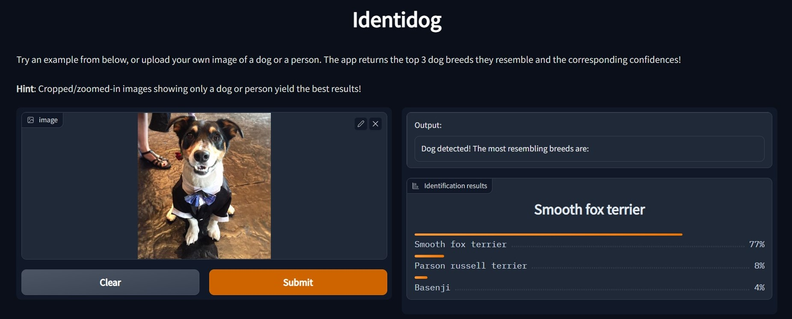

# Identidog - A Dog Breed Identification App

This is the main repository for my app Identidog.

As the screenshot shows, the app takes an input image showing a dog or a person and returns the top resembling breeds 🐶. One may try out and use the app in any web browser by visiting this [page](https://huggingface.co/spaces/alexeikud/identidog) served by the AI/ML platform [Hugging face spaces](www.huggingface.co).

## Repo Layout
The repo is organised as follows:

- The root folder contains the README.md, (MIT) Licence information, the configuration files: ``requirements.txt`` and ``environment.yml``, a project notebook ``walkthrough.ipynb`` containing a detailed walkthrough of the development of the app, and the folder "walkthrough_imgs" containing its respective images.

- The folder "app" contains all python scripts, images and models needed to run the actual app. In particular, the main script is contained in ``app.py``.

## How Identidog came to be
 Identidog was developed as a fun machine learning project for identification of the mixed breed dogs in my home. Although dog identification apps have already been available since [2016](https://news.microsoft.com/features/fetch-new-microsoft-garage-app-uses-artificial-intelligence-to-name-that-breed/), I found most give unsatisfactory results for mixed breeds - and figured I would obtain a better understanding of the methods and limitations by making my own app.

 In addition, the project was meant to help cement techniques I was learning from fastai's deep-learning [course](https://course.fast.ai/).

## How Identidog works
The app essentially strings together three image classifiers:
- A classifier which detects human faces in image
- A classifier which detects whether a dog is in the image
- A classifier which identifies dog breeds from among 133 of some of the most well-known categories.

For the first two classifiers we load pretrained models: a front-facing haarcascades model from [OpenCV](https://github.com/opencv/opencv[) for face detection and the VGG-16 Convolutional Neural Network (CNN) from [PyTorch Hub](https://pytorch.org/hub/), pretrained on the [Imagenet](https://www.image-net.org/) database.

The breed identifier was created by fine-tuning a pretrained CNN ResNet (also trained on Imagenet) to our specific dataset of 133 dog breeds using the fastai library.

### Acknowlegements
- This project was based on this [repo](https://github.com/udacity/deep-learning-v2-pytorch/tree/master/project-dog-classification) from Udacity. In particular, the training data and template for the walkthrough were obtained there.
- Fastai's deep learning course and [book](https://github.com/fastai/fastbook) were invaluable resources in learning how to train and deploy a CNN classifier using transfer learning.
- This app is dedicated to Cosmo, Loki and Monty.

**Author**: Alexei Kudryashov
